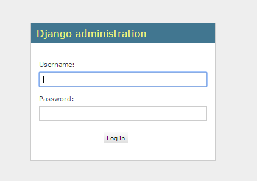

Writing your first Django app, part 2
=====================================

Creating an admin user
----------------------

::

    $ python manage.py createsuperuser

Start the development server
----------------------------

::

    $ python manage.py runserver

Now, open a Web browser and go to “/admin/” on your local domain – e.g., http://127.0.0.1:8000/admin/. You should see the admin’s login screen:

Login with the account you created just now. After login, you can find we can modify "Groups" and "Users". But where are the models we defined.

Make the poll app modifiable in the admin
-----------------------------------------

Open the polls/admin.py file, and edit it to look like this:

::

    from django.contrib import admin
    from polls.models import Question, Choice

    admin.site.register(Question)
    admin.site.register(Choice)
